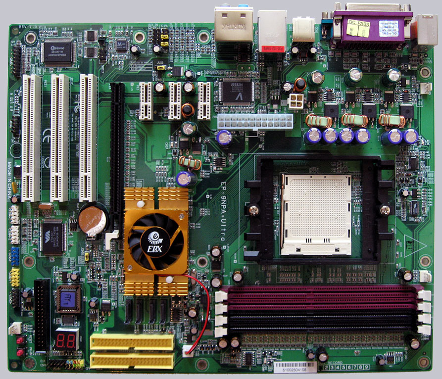

# EPoX 9NPA+ Ultra

* BIOSes taken from **[The Retro Web](https://theretroweb.com/motherboards/s/epox-pronix-ep-9npa-plus-ultra)**.
* Use **[Winflash v1.97](https://github.com/belomaxorka/EPoX-9NPA-Ultra-BIOSes/raw/main/Winflash%20v1.97.zip)** for flashing (Checksum MD5: 253BE9ACF68FFD6C4608B54B6CA2F06B).
* Flashing from **Windows XP 32bit** is recommended.
***
**9npa6811.bin** ([Download](https://github.com/belomaxorka/EPoX-9NPA-Ultra-BIOSes/raw/main/6811%20(Latest)/9npa6811.bin)) **(Latest) (Recommended)**
* Checksum (MD5): 8551E2AD1144D1E357D81E65BC3F538D
* Release date: 08/11/2006
* Changelog:
  1. Fixed Maxtor diamonMax 10 HD can't detect issue.
  2. Added "Drive strength item" and "32 Byte Granularity" item.
***
**9npa6418.bin** ([Download](https://github.com/belomaxorka/EPoX-9NPA-Ultra-BIOSes/raw/main/6418/9npa6418.bin))
* Checksum (MD5): 8A5CD1606703D632B13EA4F77485FDC2
* Release date: 04/18/2006
* Changelog:
  1. Added: "Burst Length" and "DRAM Bank Interleaving" item. (Again???)
  2. Solved Some old type PCI VGA hang at POST 29h when full screen logo show.
  3. Fixed: Copy failure if copy file from PATA HDD to USB2.0 HDD.
  4. Added: 150Mhz and 183Mhz options for memory clock item.
***
**9npa6103.bin** ([Download](https://github.com/belomaxorka/EPoX-9NPA-Ultra-BIOSes/raw/main/6103/9npa6103.bin))
* Checksum (MD5): B5EDC44F95038146C8779CD202FFD7AA
* Release date: 01/03/2006
* Changelog:
  1. Solved the full screen logo color palette not correct.
***
**9npa5c21.bin** ([Download](https://github.com/belomaxorka/EPoX-9NPA-Ultra-BIOSes/raw/main/5c21/9npa5c21.bin))
* Checksum (MD5): 1DC4F065375F1D6B202671EB8FBD2A99
* Release date: 12/21/2005
* Changelog:
  1. Solved CPU ratio adjust fail.
***
**9npa5c06.bin** ([Download](https://github.com/belomaxorka/EPoX-9NPA-Ultra-BIOSes/raw/main/5c06/9npa5c06.bin))
* Checksum (MD5): 7289AF98859865332F3B4A7E3A2F489B
* Release date: 12/06/2005
* Changelog:
  1. Added Special I/O and USB park mode item.
  2. Added Support FX-60 CPU.
  3. Added "DRAM Bank Interleaving" and "Burst Length" item.
  4. Fixed boot block code overwrite.
***
**9npa5a18.bin** ([Download](https://github.com/belomaxorka/EPoX-9NPA-Ultra-BIOSes/raw/main/5a18/9npa5a18.bin)) **(Beta)**
* Checksum (MD5): 7AB0B1637D62BF2716C0015BCCD2E426
* Release date: 10/18/2005
* Changelog:
  1. Fixed ADA3XXXDKA4CG CPUs show wrong CPU name.
  2. Update K8 939 down code CPU (ADA3200DKA4CG, ADA3500DKA4CG, ADA3700DKA5CF, ADA4000DKA5CF).
  3. Update Cool\'n'Quiet PST table.
***
**9npa5a03.bin** ([Download](https://github.com/belomaxorka/EPoX-9NPA-Ultra-BIOSes/raw/main/5a03/9npa5a03.bin))
* Checksum (MD5): 537094F63CC908980B60168D0AF815FF
* Release date: 10/03/2005
* Changelog:
  1. Added: CPU ratio X.5 support.
  2. USB KB still hot plug will hang up USB KB in CMOS.
***
**9npa5923.bin** ([Download](https://github.com/belomaxorka/EPoX-9NPA-Ultra-BIOSes/raw/main/5923/9npa5923.bin))
* Checksum (MD5): 68259D9F12B22B54CFDCB6F1E009570C
* Release date: 09/23/2005
* Changelog:
  1. Added: EPoX M/B information to DMI.
***
**9npa5914.bin** ([Download](https://github.com/belomaxorka/EPoX-9NPA-Ultra-BIOSes/raw/main/5914/9npa5914.bin))
* Checksum (MD5): 51A26F4DE616A5342F349894CA447FA0
* Release date: 09/14/2005
* Changelog:
  1. Fixed download zip file error when using new version NV LAN driver and enable NV firewall.
  2. Hide memory 1T/2T item for C0 version CPU.
  3. Added DIMM over-voltage up to 3.2v.
  4. Set 200Mhz as default for "Memory Frequency" by K8 754 Ex version CPU.
  5. Added CPU overclock up to 450Mhz.
  6. Set HT as 1x if FSB over 230Mhz.
  7. Fixed "PWRON after PWR-Fail" function fail for F71872F.
  8. Add Show Correct SATA hard disk string.
  9. Patch system boot from USB FDD, and Set USB mouse enable in BIOS, PS2/USB KB can't work.
***
**9npa5804.bin** ([Download](https://github.com/belomaxorka/EPoX-9NPA-Ultra-BIOSes/raw/main/5804/9npa5804.bin))
* Checksum (MD5): 113A0CFCFB7592828674BA7839513F77
* Release date: 08/04/2005
* Changelog:
  1. Added CPU voltage adjust support -0.1.
  2. Disable WPT Support.
  3. Fix 939 Athlon 64 E6 3800 CPU(ADA3800DAA4BP) hang at post if single side DIMM*4 exists.
  4. Show "Sempron 64-bit CPU" string.
  5. Added "off" option for "CPU Voltage" item.
  6. Disabled adjust CPU voltage offset function.
***
**9npa5728.bin** ([Download](https://github.com/belomaxorka/EPoX-9NPA-Ultra-BIOSes/raw/main/5728/9npa5728.bin))
* Checksum (MD5): 4D0C4C7695EC23B2C243CBBFA7860064
* Release date: 07/28/2005
* Changelog:
  1. Added: Support Dual core CPU(E6).
  2. Added: DDR433, DDR466, DDR500 Support for E version CPU.
  3. Added: Support for 4GB memory and more.
  4. Added: New EPTP support.
  5. Updated: PST table.
***
**9npa5629.bin** ([Download](https://github.com/belomaxorka/EPoX-9NPA-Ultra-BIOSes/raw/main/5629/9npa5629.bin))
* Checksum (MD5): B25BF6B30741774153270FD8D20F0A60
* Release date: 06/29/2005
* Changelog:
  1. Added: Dual core CPU support.
  2. Added: Athlon/Sempron E6(64bit) CPU support.
***
**9npa5322.bin** ([Download](https://github.com/belomaxorka/EPoX-9NPA-Ultra-BIOSes/raw/main/5322/9npa5322.bin))
* Checksum (MD5): 47357430BAC24F6AC48F40E7A0251572
* Release date: 03/22/2005
* Changelog:
  1. Set default disabled for "AMD K8 Cool\'n'Quiet" item.
  2. Added "Delay For HDD (Secs)" item.
  3. Added Rev.E CPU support.
  4. Patch Windows XP SP2 + Cool\'n'Quiet enabled, system hang at POST 01h after software reset.
  5. Patch system can't enter SETUP when PC health enabled and OEM error message showed.
  6. Set HT 4x for specific CPU ADA3400DEP4AZ.
***
**9npa5302.bin** ([Download](https://github.com/belomaxorka/EPoX-9NPA-Ultra-BIOSes/raw/main/5302/9npa5302.bin))
* Checksum (MD5): C1C4465E7B172B3581FE7CA45A05A330
* Release date: 03/02/2005
* Changelog:
  1. Enable IRQ Resources items.
  2. Update full screen logo.
  3. Solve incorrect CPU temperature.
  4. Set default disabled for NV Raid Boot ROM, NV LAN Boot ROM items.
  5. Enable APIC item.
  6. Set default enable for Boot Up Floppy Seek.
  7. Set Default Shadow for USB Memory Type item.
